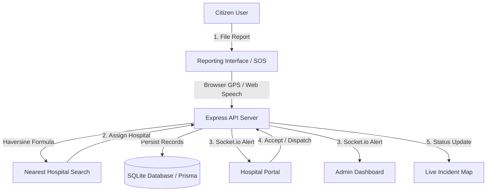

# 🏥 RoadAid: India Emergency Response & Ambulance Triage System

**RoadAid** is a modern, responsive, and real-time emergency coordination platform designed to minimize accident response times. It enables citizens to instantly report road accidents, auto-detects geolocation, uses distance algorithms to match the nearest hospital, and dispatches responders instantly.

---

## 🚀 Key Features

* **Instant Geolocation Reporting**: One-click reporting with browser Geolocation API coordinates, customizable landmarks, and manual fallback adjustments.
* **Smart Hospital Allocation**: Uses the **Haversine formula** to compute distances and estimate travel times, automatically assigning the closest active hospital to the accident location.
* **Real-time Live Telemetry**: Full integration with **Socket.io** to broadcast alerts instantly, update status timelines, and sound sirens in triage rooms.
* **Multilingual Translation Support**: Integrated translation framework supporting both English (EN) and Hindi (HI) languages.
* **Offline Incident Cache**: Local storage caching system that saves accident reports filed during network outages, auto-syncing them once internet is recovered.
* **AI Severity Estimation (Simulated)**: Processes uploaded accident photos to automatically predict incident severity level (Critical, Moderate, Minor) and log visual diagnostics.
* **Speech-to-Text Dictation**: Uses the browser's Web Speech API (`SpeechRecognition`) for hands-free incident descriptions in both English and Hindi.
* **Progressive Web App (PWA)**: Completely mobile-optimized and installable as a native app on iOS or Android.

---

## 🛠️ Architecture & Workflow



---

## 📸 Interface Preview

Here is a preview of the interactive landing page and live dashboard:


---

## 📂 Project Structure

```text
road-aid/
├── backend/
│   ├── prisma/             # Prisma SQLite Schema and Seed scripts
│   └── src/                # Express API and Socket.io server
├── frontend/
│   ├── src/app/            # Next.js App Router Page components
│   ├── src/components/     # Shared layout components (Leaflet maps, Navbar)
│   └── public/             # PWA assets and manifests
└── run-node.ps1            # Portable Node/NPM wrapper script
```

---

## 💻 Local Installation & Setup

RoadAid is built with a self-contained, portable environment. You do not need to install Node or NPM globally.

### 1. Prerequisite Setup
Initialize the portable Node.js environment (installs v20.18.0 LTS locally to the workspace):
```powershell
powershell -ExecutionPolicy Bypass -File setup.ps1
```

### 2. Configure Backend
Install dependencies and run Prisma database migrations:
```powershell
cd backend
powershell -ExecutionPolicy Bypass -File ../run-node.ps1 npm install
powershell -ExecutionPolicy Bypass -File ../run-node.ps1 npx prisma db push
powershell -ExecutionPolicy Bypass -File ../run-node.ps1 prisma/seed.js
```

Start the Express API server:
```powershell
powershell -ExecutionPolicy Bypass -File ../run-node.ps1 src/server.js
```

### 3. Configure Frontend
Open a new terminal tab and configure the Next.js client:
```powershell
cd frontend
powershell -ExecutionPolicy Bypass -File ../run-node.ps1 npm install
powershell -ExecutionPolicy Bypass -File ../run-node.ps1 npm run dev
```

The application will be live at:
* **Citizen Portal**: `http://localhost:3000`
* **Live Incident Map**: `http://localhost:3000/dashboard`
* **Hospital Portal**: `http://localhost:3000/hospital`
* **Admin Dashboard**: `http://localhost:3000/admin`

---

## 🔐 Credentials for Seeding Accounts

* **Administrator**: `admin@roadaid.in` / `admin123`
* **AIIMS Delhi Hospital**: `emergency@aiims.edu` / `password123`
* **Safdarjung Hospital**: `emergency@safdarjunghospital.gov.in` / `password123`
