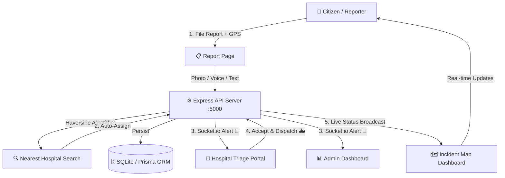
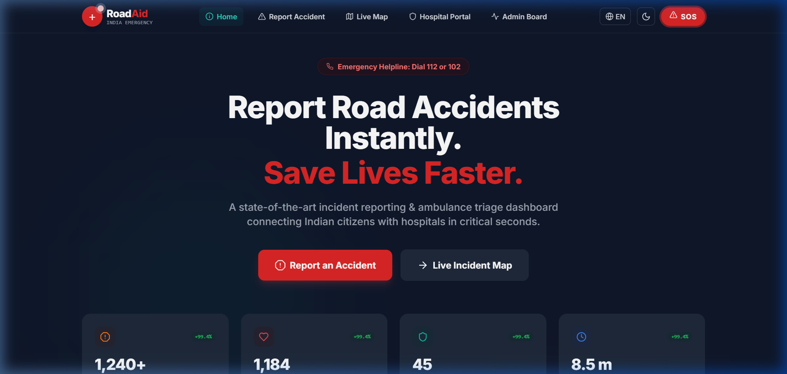

# 🏥 RoadAid India — Emergency Response & Ambulance Triage System

**RoadAid** is a modern, real-time emergency coordination platform built specifically for Indian road accident scenarios. Citizens instantly report accidents with GPS, AI photo analysis, and voice dictation — while the nearest hospital is auto-dispatched using Haversine distance algorithms.

---

## 🚀 Key Features

| Feature | Description |
|---|---|
| 📍 **Instant GPS Reporting** | One-click report with automatic browser Geolocation, photo upload, and manual map fallback |
| 🧠 **Smart Hospital Allocation** | Haversine formula computes distances to all 25 partner hospitals and assigns the nearest active one |
| ⚡ **Real-time Telemetry** | Socket.io broadcasts alerts instantly — live status updates, sound sirens in triage rooms |
| 🌐 **Multilingual UI** | English (EN) and Hindi (हिंदी) support with live language switcher in the Navbar |
| 📴 **Offline Incident Cache** | LocalStorage caching saves reports during outages and auto-syncs when internet returns |
| 🤖 **AI Severity Estimation** | Accident photo analysis predicts CRITICAL / MODERATE / MINOR severity with confidence score |
| 🎤 **Voice Dictation** | Web Speech API (`SpeechRecognition`) for hands-free reporting in EN & HI |
| 📱 **Progressive Web App** | Fully mobile-optimized, installable on iOS/Android with PWA manifest |
| 🏥 **25 Delhi NCR Hospitals** | Real hospitals across Central, South, East, North Delhi, Noida, Gurugram, Faridabad & Ghaziabad |
| 🗺️ **Interactive OpenStreetMap** | Leaflet map showing live incidents + all partner hospitals with live popup info |

---

## 🗺️ Partner Hospitals Coverage

**25 real hospitals** mapped across the entire Delhi NCR region:

- 🔴 **Central Delhi** — AIIMS, Safdarjung, RML, Lady Hardinge, Lok Nayak
- 🟠 **South Delhi** — Max Saket, Fortis Vasant Kunj, Apollo Cradle, Moolchand, Holy Family, Primus
- 🟡 **South-East** — Indraprastha Apollo, Venkateshwar Dwarka
- 🟢 **North Delhi** — Hindu Rao, St. Stephen's, Max Shalimar Bagh, BLK-Max
- 🔵 **East Delhi** — GTB Hospital Shahdara
- 🟣 **Noida** — Fortis Noida, Kailash Hospital
- ⚫ **Gurugram** — Medanta, Artemis, Paras Hospital
- 🟤 **NCR Outskirts** — Asian Hospital Faridabad, Yashoda Hospital Ghaziabad

---

## 🛠️ Architecture & Workflow



## 📸 Interface Preview



---

## 📂 Project Structure

```text
road-aid/
├── backend/
│   ├── prisma/
│   │   ├── schema.prisma       # Data models: User, Hospital, Incident
│   │   └── seed.js             # 25 real Delhi NCR hospitals seed script
│   └── src/
│       ├── server.js           # Express + Socket.io API engine
│       └── middleware/auth.js  # JWT authentication middleware
├── frontend/
│   ├── src/app/
│   │   ├── page.js             # Landing page (EN/HI bilingual)
│   │   ├── report/page.js      # Accident reporting (GPS + AI + Voice)
│   │   ├── dashboard/page.js   # Live incident map & feed
│   │   ├── hospital/page.js    # Hospital triage portal
│   │   └── admin/page.js       # Admin analytics & CSV export
│   └── src/components/
│       ├── MapComponent.jsx    # Leaflet OSM map with hospital markers
│       └── Navbar.jsx          # Top nav with EN/HI language switcher
├── run-node.ps1                # Portable Node/NPM wrapper (Windows)
└── setup.ps1                   # One-time environment bootstrap script
```

---

## 💻 Local Setup & Installation

> RoadAid uses a **portable Node.js environment** — no global Node/NPM installation required.

### 1. Bootstrap the Environment
```powershell
powershell -ExecutionPolicy Bypass -File setup.ps1
```

### 2. Backend Setup
```powershell
cd backend

# Install dependencies
powershell -ExecutionPolicy Bypass -File ../run-node.ps1 npm install

# Push Prisma schema to SQLite
powershell -ExecutionPolicy Bypass -File ../run-node.ps1 npx prisma db push

# Seed 25 Delhi NCR hospitals
powershell -ExecutionPolicy Bypass -File ../run-node.ps1 prisma/seed.js

# Start Express + Socket.io API server
powershell -ExecutionPolicy Bypass -File ../run-node.ps1 src/server.js
```

### 3. Frontend Setup
```powershell
cd frontend

# Install dependencies
powershell -ExecutionPolicy Bypass -File ../run-node.ps1 npm install

# Start Next.js dev server
powershell -ExecutionPolicy Bypass -File ../run-node.ps1 npm run dev
```

### 4. Open in Browser

| Portal | URL |
|---|---|
| 🏠 Citizen Home | `http://localhost:3000` |
| 🚨 Report Accident | `http://localhost:3000/report` |
| 🗺️ Live Incident Map | `http://localhost:3000/dashboard` |
| 🏥 Hospital Portal | `http://localhost:3000/hospital` |
| 📊 Admin Dashboard | `http://localhost:3000/admin` |

---

## 🔐 Default Login Credentials

| Role | Email | Password |
|---|---|---|
| Administrator | `admin@roadaid.in` | `admin123` |
| AIIMS Delhi | `emergency@aiims.edu` | `password123` |
| Safdarjung Hospital | `emergency@safdarjunghospital.gov.in` | `password123` |
| Max Saket | `saket@maxhealthcare.com` | `password123` |
| Medanta Gurugram | `info@medanta.org` | `password123` |

---

## 🏗️ Tech Stack

| Layer | Technology |
|---|---|
| Frontend | Next.js 14, React 18, Tailwind CSS |
| Maps | Leaflet.js + React-Leaflet (OpenStreetMap) |
| Animations | Framer Motion |
| Backend | Node.js, Express 4, Socket.io 4 |
| Database | SQLite (via Prisma ORM) |
| Auth | JWT + bcryptjs |
| Icons | Lucide React |
| PWA | Web App Manifest + Service Worker |
| Speech | Web Speech API (SpeechRecognition) |

---

## 📜 License

MIT License — Built with ❤️ for India's Road Safety
